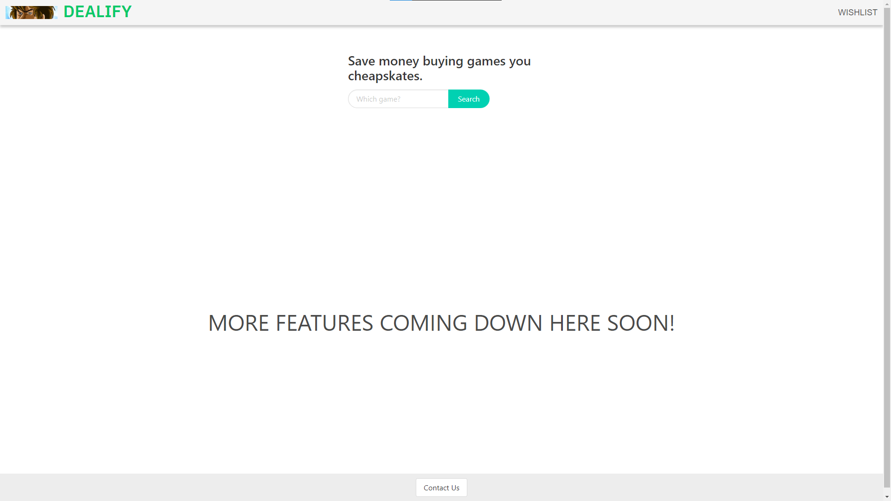
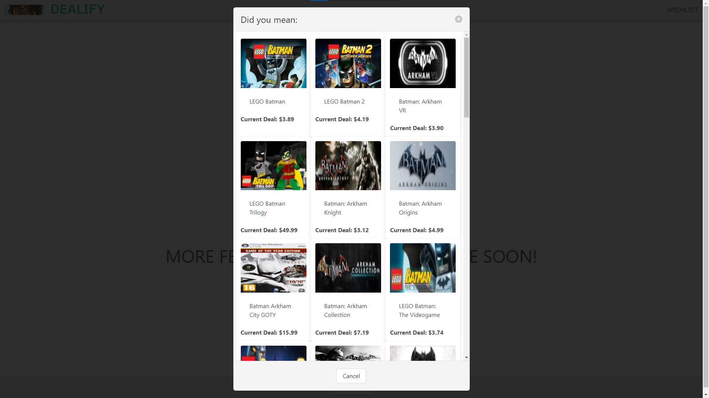
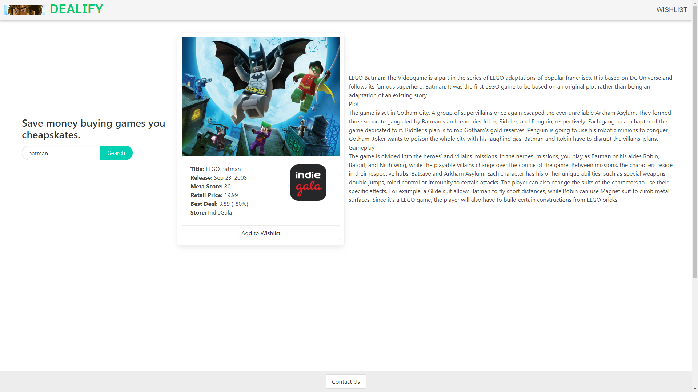

# DEALIFY

#### Group Project One: 
DEALIFY is a website collaborated between four students: 

[Hunter B. ](https://github.com/HunterBell512)| [Daniel J.](https://github.com/DanielJutila) | [David R. ](https://github.com/CallBeyond)|  [Daniel W.](https://github.com/Vermello25)

The site is dedicated to helping users quickly find the most cost-effective deals for video games currently available in the market.

 
## Link To Website
[Click here to be re-directed and save some money!](https://hunterbell512.github.io/dealify/)

## Usage
1. Click the search bar and search for a game title (i.e Batman)
2. Click the deal shown
3. Game page will load and give a brief description along with a logo of the store that has the cheapest price currently available. 

## Screenshots

## Credits

UofM-VIRT-FSF-PT-10-2023-U-LOLC-ENTG

[Bulma](https://bulma.io/)

[OpenCriticAPI](https://app.swaggerhub.com/apis-docs/OpenCritic/OpenCritic-API/1.0.0#/)

[RAWG Video Game Database](https://rapidapi.com/accujazz/api/rawg-video-games-database/details)

## License

[MIT](https://choosealicense.com/licenses/mit/)

